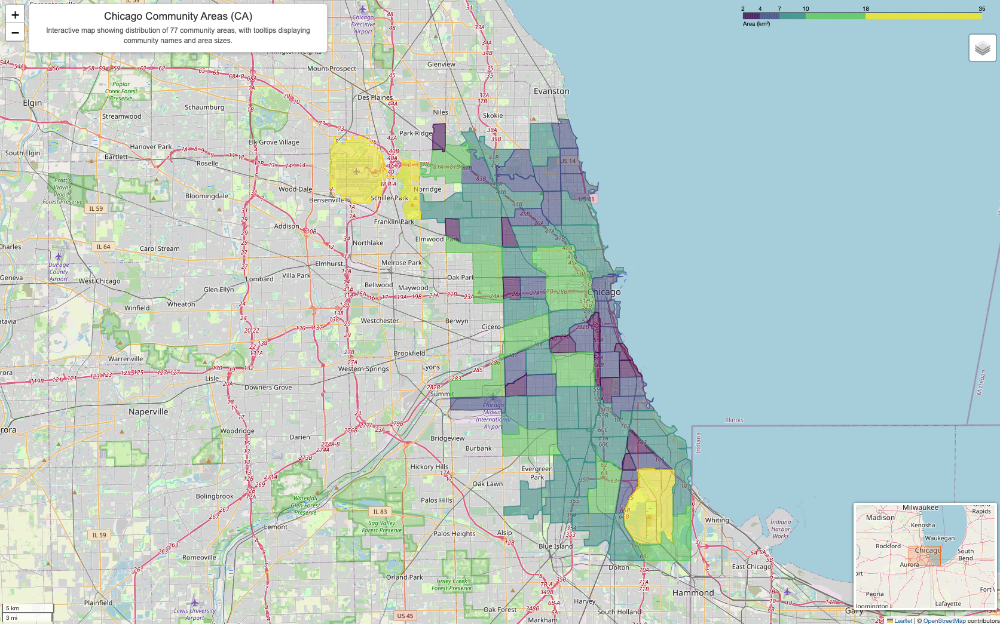

# chicago-CA-map
Interactive map of the Community Areas (CAs) in Chicago.

## Description
The interactive map shows the spatial distribution and area size of the 77 CAs in Chicago. Hover the mouse to display the CA name and area (km²). The interactive function is implemented based on the OpenStreetMap basemap. A small overview map is displayed in the bottom-right corner to provide geographic context of Chicago within a broader spatial scale.
We first project the original shapefile data onto the UTM zone 16N suitable for Chicago (EPSG:32616) to calculate the area in square kilometers, and then reproject the data back to EPSG:4326 for visualization. Data source: Chicago Data Portal (https://data.cityofchicago.org). Geospatial analysis based on GeoPandas and Folium libraries.

## Interactive Map

Click the image below to open the interactive map.

🔗 https://shuyue-qu-81.github.io/chicago-CA-map/

## Author
Shuyue
